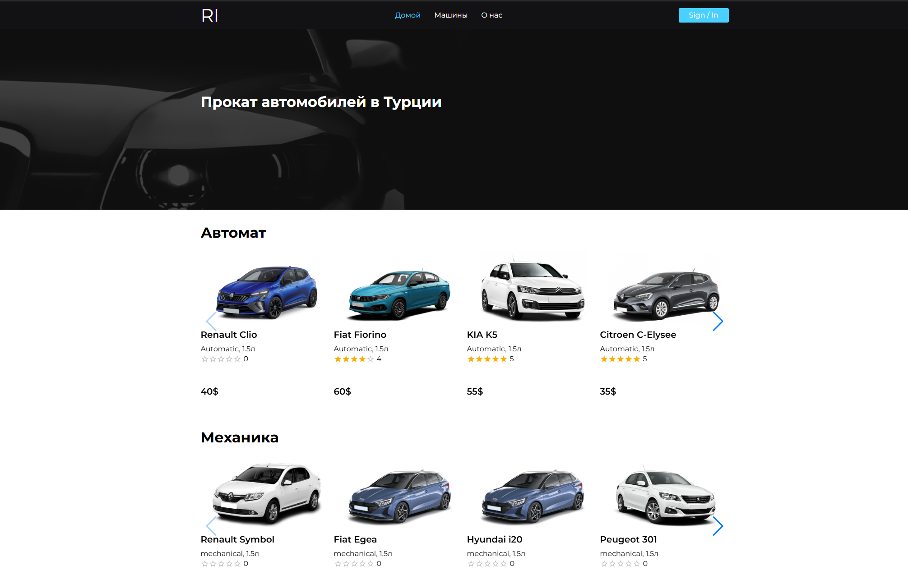

Hi My name is gadji
=============================================================================================================================

I am a Frontend Developer

I've been studying web development for a year and a half. I learned using Google and YouTube

* 🌍  I'm based in Makhachkala
* ✉️  You can contact me at [https://t.me/gadji1801055](mailto:https://t.me/gadji1801055)
* 🚀  I'm currently working on [Car-rental](http://github.com/YakhyaevGadji/car-rent)
* 🧠  I'm currently learning NextJs in depth.

<h1>My stack</h1>
<h2>Languages</h2>

  &nbsp;
  &nbsp;
  &nbsp;
  &nbsp;
  &nbsp;

<h2>Frameworks and Libraries</h2>

  &nbsp;
  &nbsp;
  &nbsp;
  &nbsp;
  &nbsp;

<h2>Tools</h2>

  &nbsp;
  &nbsp;
  &nbsp;

<h2>Methodologies</h2>

  &nbsp;
  &nbsp;

<h1>Stats</h1>

<h1>Protfolio 💼</h2>
<h2>Car-Rend</h3>

<!--
**YakhyaevGadji/YakhyaevGadji** is a ✨ _special_ ✨ repository because its `README.md` (this file) appears on your GitHub profile.

Here are some ideas to get you started:

- 🔭 I’m currently working on ...
- 🌱 I’m currently learning ...
- 👯 I’m looking to collaborate on ...
- 🤔 I’m looking for help with ...
- 💬 Ask me about ...
- 📫 How to reach me: ...
- 😄 Pronouns: ...
- ⚡ Fun fact: ...
-->
